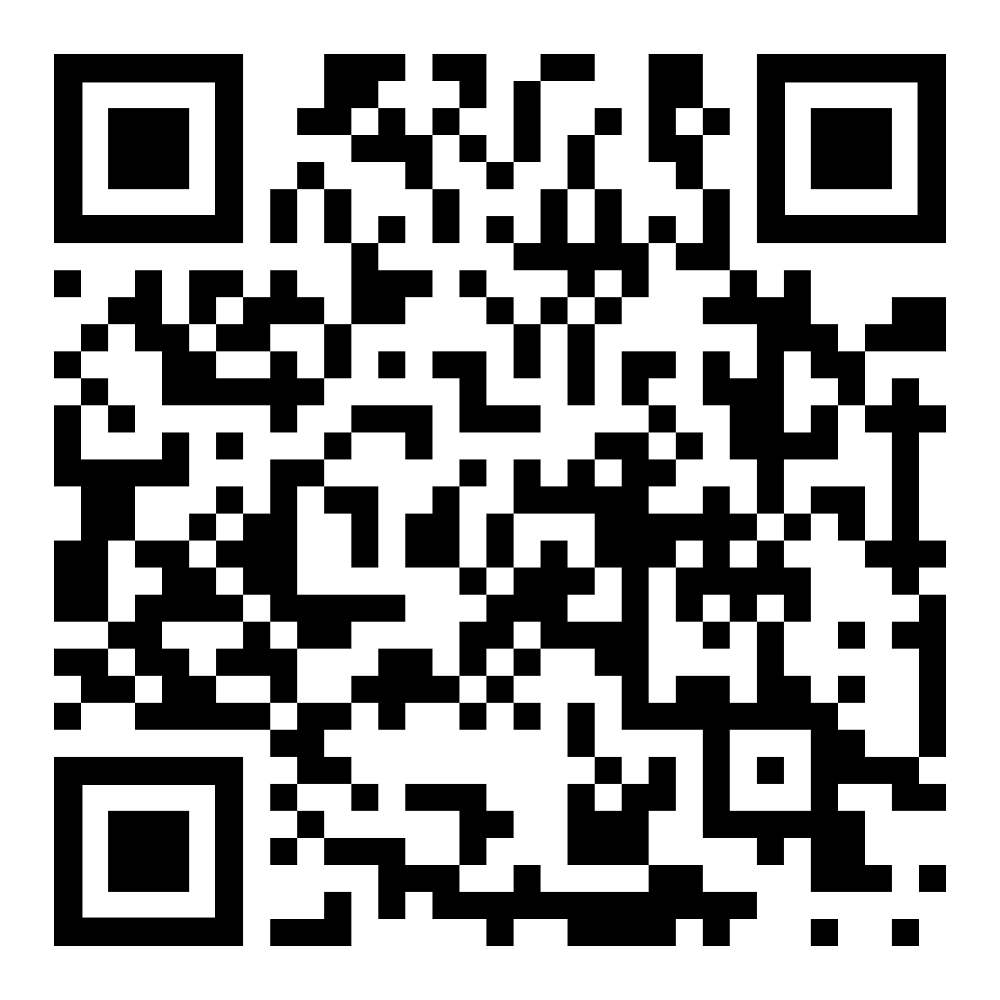

# Design System — Repuestos de Bici Jorge

> **Fuente única de verdad para la migración.**
> Este documento contiene TODO lo necesario para reconstruir el sistema visual de
> "Repuestos de Bici Jorge" desde cero en otra cuenta/instancia, sin acceso a los
> archivos originales. Incluye tokens, componentes con código completo, guías de
> uso y un prompt de reconstrucción listo para pegar.

**Negocio:** Repuestos de bicicleta — comercio de barrio.
**Titular:** Jorge.
**Datos de contacto canónicos:**
- WhatsApp / teléfono: `11 5476-7247` → link `https://wa.me/5491154767247`
- Dirección: `Siria 6110, Virrey del Pino`
- Horario: `Lun a Sáb · 9 a 18 hs`
- QR: apunta al catálogo online (archivo `qr-catalogo.png`).

**Idioma y voz:** español rioplatense (voseo): "Escaneá", "Elegí", "Consultá", "Mirá".
**Naturaleza de los entregables:** piezas gráficas para imprenta y pantalla
(cartel/banner gran formato, póster A4, folleto, tarjeta personal). Todo el diseño
es **vectorial** (texto + SVG + QR) para imprimir a cualquier escala sin pixelarse.

---

## 1. TOKENS DE DISEÑO

### 1.1 Colores

El sistema tiene **un tema claro (default/día)** y **un tema oscuro (noche)**. La marca
gira alrededor de un verde tipo WhatsApp; el coral es un acento puntual reservado al QR.

#### Paleta semántica — Tema Día (default)

| Token | Hex | Uso |
|---|---|---|
| `--green` | `#1FB04B` | Color de marca. Headers, botones, números de paso, CTA WhatsApp, checks. Es el verde de WhatsApp. |
| `--green-deep` | `#0E7A33` | Verde profundo para texto sobre fondos claros verdosos (pie del QR). |
| `--green-soft` | `#E6F8EC` | Verde casi blanco. Fondo del bloque QR; hace "brillar" el código. |
| `--accent` | `#F2664B` | Coral. **Solo** como foco del QR (borde de la tarjeta) y flecha "escaneá". |
| `--accent-deep` | `#C84A33` | Coral oscuro. Texto del eyebrow "Escaneá acá". |
| `--ink` | `#0B1220` | Texto principal (casi negro azulado). |
| `--ink-2` | `#46556A` | Texto secundario / descripciones. |
| `--paper` | `#FFFFFF` | Fondo de las piezas (papel). |
| `--card` | `#F4F6FA` | Fondo de tarjetas internas (pasos). |

#### Paleta semántica — Tema Noche

Mismos nombres de token, distintos valores. Mantiene el verde de marca pero invierte
papel/tinta hacia un azul-noche cálido + texto crema.

| Token | Hex | Nota |
|---|---|---|
| `--green` | `#1FB04B` | Igual — la marca WhatsApp no cambia. |
| `--green-deep` | `#0E7A33` | Verde profundo sobre crema. |
| `--green-soft` | `#F0E5D3` | "Luz" cálida tipo papel; hace que el QR brille en oscuro. |
| `--ink` | `#F2E9D8` | Texto crema cálido (no blanco puro). |
| `--ink-2` | `#A8B5C0` | Texto secundario gris frío. |
| `--paper` | `#13202C` | Fondo principal: azul-noche cálido. |
| `--card` | `#1F303D` | Tarjetas: un escalón más claro que el fondo. |

> En el tema Noche el QR pierde el coral: el borde de la tarjeta QR usa `--green`
> en lugar de `--accent` (mejor contraste sobre fondo crema cálido).

#### Colores utilitarios / fuera de token

| Color | Hex | Uso |
|---|---|---|
| Blanco puro | `#FFFFFF` | Texto sobre verde, bordes del emblema, fondo de tarjeta QR. |
| Stage oscuro | `#1a1a1a` | Fondo del lienzo en pantalla (detrás de la pieza) en carteles/tarjetas. |
| Stage UI | `#15191e` | Fondo de pantallas de comparación (Emblemas, Acentos). |
| Panel UI | `#1d242c` / `#1F242C` | Tarjetas de las pantallas de comparación. |
| Texto UI atenuado | `#9aa6b2` / `#aeb8c2` / `#cfd8e2` | Subtítulos en pantallas de comparación. |
| Badge UI | `#2b3440` | Chip/badge de las pantallas de comparación. |
| Label gris | `#7d8a98` | Etiqueta "Frente · Dorso". |

#### Acentos explorados (decisión de diseño registrada)

Se compararon tres acentos para el foco del QR. **Ganador: Coral** por calidez y energía,
aunque el azul tinta quedó como alternativa "más profesional/calma".

| Opción | Hex | Veredicto |
|---|---|---|
| Azul tinta | `#1E4FA3` | Profesional y calmo; combo azul+verde se lee intencional. |
| **Coral (elegido)** | `#F2664B` | Cálido y con energía; llama mucho la atención. |
| Carbón | `#2B3440` | Sobrio pero casi no se distingue del texto negro; pierde el "mirá acá". |

### 1.2 Tipografía

**Única familia:** `Plus Jakarta Sans` (Google Fonts), con fallback
`system-ui, sans-serif`.

```html
<link rel="preconnect" href="https://fonts.googleapis.com">
<link rel="preconnect" href="https://fonts.gstatic.com" crossorigin>
<link href="https://fonts.googleapis.com/css2?family=Plus+Jakarta+Sans:wght@600;700;800;900&display=swap" rel="stylesheet">
```

**Pesos en uso:** `600` (texto secundario), `700` (firma/etiquetas), `800` (títulos/CTA),
`900` (wordmark, números, teléfono).

**Rasgos tipográficos del sistema:**
- Wordmark y titulares: peso 900, `text-transform: uppercase`, `letter-spacing` muy
  negativo (`-.045em` a `-.02em`), `line-height` apretado (`.9`–.92`).
- En el wordmark "Repuestos de Bici" se usa `word-spacing: ~.2em` y cada palabra en su
  propia línea (`span { display:block }`).
- Texto corrido secundario: peso 600, `line-height` 1.25.
- Etiquetas/uppercase pequeñas: `letter-spacing` positivo (`.02em`–.2em`).

**Escala tipográfica por jerarquía** (los tamaños se reescalan según el tamaño físico de
la pieza; abajo, valores de referencia en px por contexto):

| Rol | Gran formato (banner 1200px) | A4 (794px) | Tarjeta (850px) | Peso | line-height | letter-spacing |
|---|---|---|---|---|---|---|
| Wordmark `.lede` | 156px | 72px | 64px | 900 | .9–.92 | -.045em |
| Firma `.sig` | 56px | 26px | 24px | 700 (b:900) | 1 | .02–.04em |
| Título sección | 96px | 30px | — | 800 | 1 | -.02 a -.03em |
| Paso `h3` | 60px | — | — | 800 | 1.05 | -.02em |
| Paso `p` | 36px | — | — | 600 | 1.25 | — |
| Ítem categoría | — | 21px | 19px | 700 | 1 | -.01em |
| Pills meta (hs/zona) | 34px | 20px | 19px | 800 | 1 | .02em |
| Eyebrow QR | 62px | 36px | 22px | 900 | 1.02 | -.015em |
| Pie QR | 34px | 20px | — | 800 | 1 | .04em (uppercase) |
| Teléfono CTA | 100px | 54px | 42px | 900 | 1 | -.02 a -.025em |
| Etiqueta UI | — | — | 14px | 700 | 1 | .2em (uppercase) |

### 1.3 Espaciado

El sistema **no** define una escala de espaciado nombrada; usa una progresión empírica
basada en múltiplos suaves. Valores recurrentes (px), normalizados como escala portable:

| Step | px | Uso típico |
|---|---|---|
| `space-1` | 6–8 | gaps mínimos (icono+texto chico) |
| `space-2` | 10–12 | gap firma, gap checks |
| `space-3` | 16–18 | gap pills, padding chico |
| `space-4` | 20–24 | gap entre pasos, gap meta-row |
| `space-5` | 28–32 | padding tarjeta QR, gap items |
| `space-6` | 36–44 | padding pasos, gap header |
| `space-7` | 50–60 | padding header / secciones gran formato |

Padding canónico por contenedor (gran formato):
- Header: `50px 60px 36px`
- Steps (sección): `40px 60px`
- Step (tarjeta): `30px 44px`
- QR block: `40px 60px 44px`
- WhatsApp CTA: `34px 40px`, margen `28px 60px 36px`

### 1.4 Radios de borde

| Token | Valor | Uso |
|---|---|---|
| `radius-pill` | `999px` | Pills de horario/zona. |
| `radius-banner` | `56px` | Esquina del banner gran formato. |
| `radius-qr` | `40px` | Tarjeta QR gran formato. |
| `radius-cta` | `36px` | CTA WhatsApp gran formato. |
| `radius-card` | `32px` | Tarjeta personal / tarjeta de paso. |
| `radius-num` | `28px` | Cuadro de número de paso / icono CTA. |
| `radius-poster` | `20px` | Póster A4 y tarjetas internas. |
| `radius-qr-sm` | `18–22px` | Tarjeta QR en A4 / tarjeta personal. |
| `radius-ico-sm` | `14–16px` | Icono WhatsApp en piezas chicas. |

Escala portable sugerida: `12 / 18 / 22 / 28 / 32 / 40 / 56 / 999`.

### 1.5 Sombras

| Token | Valor | Uso |
|---|---|---|
| `shadow-banner` | `0 30px 80px rgba(0,0,0,.35)` | Banner gran formato (solo pantalla). |
| `shadow-poster` | `0 20px 60px rgba(0,0,0,.35)` | Póster A4 / tarjeta personal (solo pantalla). |
| `shadow-ui` | `0 12px 40px rgba(0,0,0,.4)` | Tarjetas de pantallas de comparación. |
| `ring-accent` | `0 0 0 8px var(--accent)` | "Marco" coral de la tarjeta QR (gran formato). |
| `ring-accent-sm` | `0 0 0 4px / 5px var(--accent)` | Marco QR en tarjeta / A4. |
| `ring-green` | `0 0 0 8px var(--green)` | Marco del QR en tema Noche. |

> **Importante:** todas las `box-shadow` decorativas se eliminan en `@media print`
> (la pieza impresa no lleva sombra). Los "rings" del QR sí se conservan porque son
> parte del diseño impreso.

### 1.6 Breakpoints / tamaños físicos

No es un sistema responsive web; son **formatos de impresión fijos**. Cada pieza se
diseña en px a un ancho de referencia y se escala a tamaño físico en `@media print`.

| Pieza | Diseño en pantalla | Tamaño físico (`@page`) | Técnica de escalado en print |
|---|---|---|---|
| Cartel / Banner gran formato | 1200px ancho, alto por contenido | `850mm × 2125mm` | `body { zoom: 2.677 }` (= 850mm / (1200px·1/96in)) |
| Banner día 85×205 | 1200px | `~85cm × 205cm` | zoom equivalente |
| Póster A4 | 794×1123px | `A4 portrait` (210×297mm) | `.poster { width:210mm; height:297mm }` |
| Folleto A4 | 794×1123px | `A4 portrait` | igual que póster |
| Tarjeta personal | 850×550px (ratio 10×) | `85mm × 55mm` | `.card { width:850px; height:550px; page-break-after:always }` |

Reglas comunes de impresión:
- `* { -webkit-print-color-adjust:exact; print-color-adjust:exact; }`
- `@page { margin: 0 }`
- En print: fondo `#fff`, se quitan `border-radius` de borde exterior y `box-shadow`.
- Imprimir con "Gráficos de fondo" activado.

### 1.7 Tokens como variables CSS

```css
:root{
  /* ---- Tema Día (default) ---- */
  --green:        #1FB04B;
  --green-deep:   #0E7A33;
  --green-soft:   #E6F8EC;
  --accent:       #F2664B;   /* coral — foco del QR */
  --accent-deep:  #C84A33;
  --ink:          #0B1220;
  --ink-2:        #46556A;
  --paper:        #FFFFFF;
  --card:         #F4F6FA;

  /* ---- Tipografía ---- */
  --font: 'Plus Jakarta Sans', system-ui, sans-serif;

  /* ---- Radios ---- */
  --radius-pill:   999px;
  --radius-banner: 56px;
  --radius-qr:     40px;
  --radius-cta:    36px;
  --radius-card:   32px;
  --radius-num:    28px;
  --radius-poster: 20px;

  /* ---- Sombras ---- */
  --shadow-banner: 0 30px 80px rgba(0,0,0,.35);
  --shadow-poster: 0 20px 60px rgba(0,0,0,.35);
  --ring-accent:   0 0 0 8px var(--accent);
}

/* ---- Tema Noche ---- */
:root[data-theme="noche"]{
  --green:        #1FB04B;
  --green-deep:   #0E7A33;
  --green-soft:   #F0E5D3;
  --ink:          #F2E9D8;
  --ink-2:        #A8B5C0;
  --paper:        #13202C;
  --card:         #1F303D;
}
```

### 1.8 Tokens como JSON

```json
{
  "$schema": "design-tokens",
  "name": "Repuestos de Bici Jorge",
  "color": {
    "dia": {
      "green":      { "value": "#1FB04B", "use": "marca / WhatsApp" },
      "greenDeep":  { "value": "#0E7A33" },
      "greenSoft":  { "value": "#E6F8EC" },
      "accent":     { "value": "#F2664B", "use": "coral — foco QR" },
      "accentDeep": { "value": "#C84A33" },
      "ink":        { "value": "#0B1220" },
      "ink2":       { "value": "#46556A" },
      "paper":      { "value": "#FFFFFF" },
      "card":       { "value": "#F4F6FA" }
    },
    "noche": {
      "green":      { "value": "#1FB04B" },
      "greenDeep":  { "value": "#0E7A33" },
      "greenSoft":  { "value": "#F0E5D3" },
      "ink":        { "value": "#F2E9D8" },
      "ink2":       { "value": "#A8B5C0" },
      "paper":      { "value": "#13202C" },
      "card":       { "value": "#1F303D" }
    },
    "accentsExplored": {
      "azulTinta": "#1E4FA3",
      "coral":     "#F2664B",
      "carbon":    "#2B3440"
    },
    "ui": {
      "stage":       "#1a1a1a",
      "stageCompare":"#15191e",
      "panel":       "#1d242c",
      "badge":       "#2b3440",
      "labelGray":   "#7d8a98",
      "white":       "#FFFFFF"
    }
  },
  "font": {
    "family": "Plus Jakarta Sans, system-ui, sans-serif",
    "weights": [600, 700, 800, 900],
    "tracking": { "tight": "-0.045em", "snug": "-0.02em", "wide": "0.02em", "label": "0.2em" }
  },
  "radius": {
    "sm": 12, "md": 18, "lg": 22, "num": 28, "card": 32,
    "cta": 36, "qr": 40, "banner": 56, "pill": 999
  },
  "shadow": {
    "banner": "0 30px 80px rgba(0,0,0,.35)",
    "poster": "0 20px 60px rgba(0,0,0,.35)",
    "ui":     "0 12px 40px rgba(0,0,0,.4)",
    "ringAccent": "0 0 0 8px #F2664B",
    "ringGreen":  "0 0 0 8px #1FB04B"
  },
  "space": [6, 8, 12, 16, 20, 24, 28, 32, 36, 44, 50, 60],
  "formats": {
    "bannerGran": { "design": "1200px", "physical": "850mm x 2125mm", "printZoom": 2.677 },
    "a4":         { "design": "794x1123px", "physical": "210mm x 297mm" },
    "tarjeta":    { "design": "850x550px", "physical": "85mm x 55mm" }
  },
  "contact": {
    "owner": "Jorge",
    "phone": "11 5476-7247",
    "whatsapp": "https://wa.me/5491154767247",
    "address": "Siria 6110, Virrey del Pino",
    "hours": "Lun a Sáb · 9 a 18 hs"
  }
}
```

---

## 2. INVENTARIO DE COMPONENTES

Todos los componentes son HTML + CSS (sin JS, sin React). Se presentan con su CSS y su
markup. Los tamaños mostrados son los de **gran formato**; para A4/tarjeta se reescalan
proporcionalmente (ver §1.2). Todos asumen los tokens de §1.7 y la fuente de §1.2.

### 2.1 Emblema (ícono de bici)

Pictograma de bicicleta, dibujado solo con SVG (líneas). Es el logo del sistema. Tiene
**4 variantes** registradas; la variante 1 es la oficial en uso.

**Variante 1 — Actual (línea fina)** · oficial en todas las piezas:
```html
<svg viewBox="-1.5 -1.5 27 27" fill="none" stroke="#fff" stroke-width="1.6"
     stroke-linecap="round" stroke-linejoin="round" style="overflow:visible">
  <circle cx="18.5" cy="17.5" r="3.5"/>
  <circle cx="5.5" cy="17.5" r="3.5"/>
  <circle cx="15" cy="5" r="1" fill="#fff"/>
  <path d="M12 17.5V14l-3-3 4-3 2 3h2"/>
</svg>
```

**Variante 2 — Línea gruesa** (`stroke-width: 2.4`, mismo path; más presencia):
```html
<svg viewBox="0 0 24 24" fill="none" stroke="#fff" stroke-width="2.4"
     stroke-linecap="round" stroke-linejoin="round">
  <circle cx="18.5" cy="17.5" r="3.5"/><circle cx="5.5" cy="17.5" r="3.5"/>
  <circle cx="15" cy="5" r="1.2" fill="#fff"/><path d="M12 17.5V14l-3-3 4-3 2 3h2"/>
</svg>
```

**Variante 3 — Insignia / roundel** (bici dentro de un círculo, se lee como sello):
```html
<span style="display:flex;align-items:center;justify-content:center;
             width:82px;height:82px;border:3.5px solid #fff;border-radius:50%;">
  <svg width="48" viewBox="0 0 24 24" fill="none" stroke="#fff" stroke-width="2"
       stroke-linecap="round" stroke-linejoin="round">
    <circle cx="18.5" cy="17.5" r="3.5"/><circle cx="5.5" cy="17.5" r="3.5"/>
    <circle cx="15" cy="5" r="1.1" fill="#fff"/><path d="M12 17.5V14l-3-3 4-3 2 3h2"/>
  </svg>
</span>
```

**Variante 4 — Silueta de perfil** (bici de costado, más detallada):
```html
<svg width="96" viewBox="0 0 64 40" fill="none" stroke="#fff" stroke-width="3"
     stroke-linecap="round" stroke-linejoin="round">
  <circle cx="13" cy="28" r="9"/>
  <circle cx="51" cy="28" r="9"/>
  <circle cx="13" cy="28" r="1.6" fill="#fff" stroke="none"/>
  <circle cx="51" cy="28" r="1.6" fill="#fff" stroke="none"/>
  <path d="M13 28 L26 28 L36 12 L20 12"/>
  <path d="M26 28 L36 12"/>
  <path d="M36 12 L51 28"/>
  <path d="M36 12 L40 8"/>
  <path d="M20 12 L24 12"/>
</svg>
```

**Variante "monocromo sobre claro"** (dorso de tarjeta, ícono verde sobre blanco): mismo
path de la variante 1 pero `stroke="currentColor"` con `color: var(--green)` y, para la
estrella central, `fill="currentColor"`:
```html
<svg viewBox="0 0 24 24" fill="none" stroke="currentColor" stroke-width="1.8"
     stroke-linecap="round" stroke-linejoin="round">
  <circle cx="18.5" cy="17.5" r="3.5"/><circle cx="5.5" cy="17.5" r="3.5"/>
  <circle cx="15" cy="5" r="1" fill="currentColor"/><path d="M12 17.5V14l-3-3 4-3 2 3h2"/>
</svg>
```

**Tratamiento "emblema enmarcado"** (header): el SVG va dentro de un círculo de borde
blanco con padding generoso:
```css
.emblem svg{
  width: 270px; height: 270px;       /* 104px en A4/tarjeta */
  border: 9px solid #fff;            /* 3.5–4px en piezas chicas */
  border-radius: 50%;
  padding: 58px;                     /* 22px en piezas chicas */
  box-sizing: border-box;
}
```

### 2.2 Wordmark `.lede` + Firma `.sig`

El bloque de marca: "REPUESTOS / DE BICI" en dos líneas, seguido de la firma "Jorge"
flanqueada por dos rayitas.

```css
.lede{
  font-weight: 900;
  font-size: 156px;          /* 72px A4 · 64px tarjeta */
  line-height: .92;
  letter-spacing: -.045em;
  word-spacing: .2em;
  text-transform: uppercase;
}
.lede span{ display: block; }

.sig{
  display: flex; align-items: center; justify-content: center;
  gap: 24px;                 /* 12–14px chico */
  margin-top: 30px;
  font-weight: 700;
  font-size: 56px;           /* 24–26px chico */
  letter-spacing: .02em;
  text-transform: uppercase;
}
.sig::before, .sig::after{
  content: ""; flex: 0 0 90px; height: 5px;   /* 28–44px / 2.5–3px chico */
  background: #fff; border-radius: 3px; opacity: .85;
}
.sig b{ font-weight: 900; letter-spacing: -.01em; }
```
```html
<h1 class="lede"><span>Repuestos</span><span>de Bici</span></h1>
<div class="sig"><b>Jorge</b></div>
```

### 2.3 Header (bloque verde de marca)

Contenedor superior verde con emblema, wordmark, firma y fila de metadatos (pills).
Es el "cap" de toda pieza vertical.

```css
.header{
  position: relative;
  background: var(--green);
  color: #fff;
  text-align: center;
  padding: 50px 60px 36px;
  overflow: hidden;
}
.header .emblem{ display:flex; justify-content:center; margin-bottom:12px; }
.header .meta-row{
  display:flex; align-items:center; justify-content:center;
  flex-wrap:wrap; gap:22px; margin-top:30px;
}
```
```html
<header class="header">
  <div class="emblem" aria-hidden="true"><!-- SVG emblema v1 --></div>
  <h1 class="lede"><span>Repuestos</span><span>de Bici</span></h1>
  <div class="sig"><b>Jorge</b></div>
  <div class="meta-row">
    <div class="hours"><span class="clock"></span>Lun a Sáb · 9 a 18 hs</div>
    <!-- opcional: <div class="zone"><span class="pin"></span>Virrey del Pino</div> -->
  </div>
</header>
```

### 2.4 Pills de metadato: Horario y Zona (con íconos CSS)

Pastillas translúcidas sobre verde. Los íconos (reloj y pin) están dibujados con CSS puro
(pseudo-elementos), no SVG.

```css
.hours, .zone{
  display:inline-flex; align-items:center; gap:18px;
  padding:16px 32px;
  background: rgba(255,255,255,.16);
  border: 3px solid rgba(255,255,255,.55);
  border-radius: 999px;
  font-weight:800; font-size:34px; letter-spacing:.02em; white-space:nowrap;
}
/* Reloj */
.hours .clock{ width:38px; height:38px; border-radius:50%; border:4px solid #fff; position:relative; }
.hours .clock::before, .hours .clock::after{ content:""; position:absolute; left:50%; top:50%; background:#fff; border-radius:2px; }
.hours .clock::before{ width:3px; height:11px; transform:translate(-50%,-100%); }
.hours .clock::after { width:9px; height:3px; transform:translate(-10%,-50%); }
/* Pin (gota) */
.zone .pin{ flex:0 0 auto; width:34px; height:38px; position:relative; }
.zone .pin::before{ content:""; position:absolute; left:50%; top:0; width:30px; height:30px; background:#fff; border-radius:50% 50% 50% 0; transform:translateX(-50%) rotate(-45deg); }
.zone .pin::after{ content:""; position:absolute; left:50%; top:9px; width:11px; height:11px; background:var(--green); border-radius:50%; transform:translateX(-50%); }
```

### 2.5 Título de sección (con resalte verde)

Titular con una palabra clave en `--green`. Patrón `.q` para el resalte.

```css
.section-title{
  text-align:center; padding:56px 60px 0;
  font-weight:800; font-size:96px; line-height:1; letter-spacing:-.03em;
}
.section-title .q{ color: var(--green); }
```
```html
<h2 class="section-title">¿Cómo <span class="q">funciona?</span></h2>
<!-- variantes de copy: "Lo que vas a <span class='q'>encontrar</span>" -->
```

### 2.6 Pasos numerados (`.steps` / `.step`)

Lista vertical de tarjetas con número grande en cuadro verde + título + bajada.

```css
.steps{ padding:40px 60px; display:flex; flex-direction:column; gap:20px; }
.step{
  background: var(--card);
  border-radius: 32px;
  padding: 30px 44px;
  display:flex; align-items:center; gap:36px;
}
.step .num{
  flex:0 0 auto; width:110px; height:110px;
  border-radius:28px; background:var(--green); color:#fff;
  font-weight:900; font-size:80px; line-height:1;
  display:flex; align-items:center; justify-content:center; letter-spacing:-.04em;
}
.step .body{ flex:1; min-width:0; }
.step h3{ font-weight:800; font-size:60px; line-height:1.05; letter-spacing:-.02em; color:var(--ink); }
.step p{ margin-top:10px; font-weight:600; font-size:36px; line-height:1.25; color:var(--ink-2); }
```
```html
<section class="steps">
  <article class="step">
    <div class="num">1</div>
    <div class="body"><h3>Escaneá el QR</h3><p>Apuntá la cámara del celular.</p></div>
  </article>
  <article class="step">
    <div class="num">2</div>
    <div class="body"><h3>Elegí el repuesto</h3><p>Mirá el catálogo.</p></div>
  </article>
  <article class="step">
    <div class="num">3</div>
    <div class="body"><h3>Consultá por WhatsApp</h3><p>Jorge te responde al toque.</p></div>
  </article>
</section>
```

### 2.7 Lista de categorías (con check verde)

Grid de 2 columnas; cada ítem con un check en círculo verde (SVG polyline). Es el
inventario del comercio.

```css
.cats .list{ display:grid; grid-template-columns:1fr 1fr; gap:14px 30px; }
.cats .item{
  display:flex; align-items:center; gap:12px;
  font-weight:700; font-size:21px; color:var(--ink);
  letter-spacing:-.01em; line-height:1; white-space:nowrap;
}
.cats .item .check{          /* en tarjeta se llama .dot */
  flex:0 0 auto; width:26px; height:26px;
  background: var(--green); border-radius:50%;
  display:flex; align-items:center; justify-content:center;
}
.cats .item .check svg{
  width:15px; height:15px; stroke:#fff; stroke-width:3.5;
  fill:none; stroke-linecap:round; stroke-linejoin:round;
}
```
```html
<div class="list">
  <div class="item"><span class="check"><svg viewBox="0 0 24 24"><polyline points="5 13 10 18 19 7"/></svg></span>Cubiertas y cámaras</div>
  <div class="item"><span class="check"><svg viewBox="0 0 24 24"><polyline points="5 13 10 18 19 7"/></svg></span>Parches y pegamentos</div>
  <div class="item"><span class="check"><svg viewBox="0 0 24 24"><polyline points="5 13 10 18 19 7"/></svg></span>Frenos y cadenas</div>
  <div class="item"><span class="check"><svg viewBox="0 0 24 24"><polyline points="5 13 10 18 19 7"/></svg></span>Asientos y manubrios</div>
  <div class="item"><span class="check"><svg viewBox="0 0 24 24"><polyline points="5 13 10 18 19 7"/></svg></span>Infladores y herramientas</div>
  <div class="item"><span class="check"><svg viewBox="0 0 24 24"><polyline points="5 13 10 18 19 7"/></svg></span>Aceite, grasa y luces</div>
</div>
```

> **Lista canónica de categorías** (no cambiar el orden ni el texto sin necesidad):
> Cubiertas y cámaras · Parches y pegamentos · Frenos y cadenas · Asientos y manubrios ·
> Infladores y herramientas · Aceite, grasa y luces.

### 2.8 Bloque QR (`.qr-block`)

Sección con fondo verde suave, eyebrow coral con flecha, tarjeta blanca con el QR
enmarcada en coral, y pie en mayúsculas.

```css
.qr-block{
  background: var(--green-soft);
  padding: 40px 60px 44px; text-align:center;
  border-top: 6px solid var(--green);
}
.qr-eyebrow{
  font-weight:900; font-size:62px; letter-spacing:-.015em; line-height:1.02;
  color: var(--accent-deep);
}
.qr-eyebrow .arrow{ display:inline-block; transform:translateY(6px); margin-right:8px; color:var(--accent); }
.qr-card{
  margin:32px auto 0; width:920px; max-width:100%;
  background:#fff; border-radius:40px; padding:40px;
  box-shadow: 0 0 0 8px var(--accent);   /* ring coral */
}
.qr-card img{ display:block; width:100% !important; height:auto !important; }
.qr-foot{
  margin-top:28px; font-weight:800; font-size:34px;
  color: var(--green-deep); letter-spacing:.04em; text-transform:uppercase;
}
```
```html
<section class="qr-block">
  <div class="qr-eyebrow"><span class="arrow">▼</span> Escaneá acá</div>
  <div class="qr-card"></div>
  <div class="qr-foot">Catálogo online</div>
</section>
```
> **Tema Noche:** cambiar `box-shadow` del `.qr-card` a `0 0 0 8px var(--green)`,
> el eyebrow a `--green-deep` y quitar el coral de la flecha.

### 2.9 CTA WhatsApp (`.wa-cta`)

Botón-enlace verde con ícono de WhatsApp en cuadro blanco + número de teléfono enorme.
Es un `<a href="https://wa.me/...">`.

```css
.wa-cta{
  margin:28px 60px 36px;
  background: var(--green); border-radius:36px; padding:34px 40px;
  display:flex; align-items:center; justify-content:center; gap:30px;
  color:#fff; text-decoration:none;
}
.wa-cta .icon{
  width:130px; height:130px; flex:0 0 auto;
  background:#fff; color:var(--green); border-radius:28px;
  display:flex; align-items:center; justify-content:center;
}
.wa-cta .icon svg{ width:92px; height:92px; }
.wa-cta .num{ font-weight:900; font-size:100px; line-height:1; letter-spacing:-.02em; white-space:nowrap; }
```
```html
<a class="wa-cta" href="https://wa.me/5491154767247">
  <span class="icon" aria-hidden="true">
    <svg viewBox="0 0 32 32" fill="currentColor">
      <path d="M19.11 17.205c-.372 0-1.088 1.39-1.518 1.39a.63.63 0 0 1-.315-.1c-.802-.402-1.504-.817-2.163-1.447-.545-.516-1.146-1.29-1.46-1.963a.426.426 0 0 1-.073-.215c0-.33.99-.945.99-1.49 0-.143-.73-2.09-.832-2.335-.143-.372-.214-.487-.6-.487-.187 0-.36-.043-.53-.043-.302 0-.53.115-.746.315-.688.645-1.032 1.318-1.06 2.264v.114c-.015.99.472 1.977 1.017 2.78 1.23 1.82 2.506 3.41 4.554 4.34.616.287 2.035.888 2.722.888.817 0 2.15-.515 2.478-1.318.13-.33.27-.66.27-1.006 0-.244-.058-.36-.226-.474-.255-.135-2.105-1.097-2.504-1.097zm-2.49 7.39h-.014c-1.857 0-3.59-.545-5.082-1.46l-3.552 1.132 1.16-3.435a8.992 8.992 0 0 1-1.74-5.323c0-4.997 4.13-9.073 9.234-9.073 2.483 0 4.812.946 6.562 2.665a8.853 8.853 0 0 1 2.715 6.408c-.002 4.992-4.13 9.085-9.282 9.085zM16.62 5C10.55 5 5.61 9.832 5.61 15.776A10.61 10.61 0 0 0 7.083 21.2L5 27.286l6.367-2.027c1.6.86 3.4 1.318 5.236 1.318h.014c6.067 0 11.092-4.832 11.092-10.778 0-2.882-1.156-5.59-3.252-7.624A11.094 11.094 0 0 0 16.622 5z"/>
    </svg>
  </span>
  <span class="num">11 5476-7247</span>
</a>
```

### 2.10 Línea de dirección (`.addr`) con pin verde

```css
.addr{
  margin:0 40px 18px;
  display:flex; align-items:center; justify-content:center; gap:12px;
  font-weight:800; font-size:26px; color:var(--ink); letter-spacing:-.01em;
}
.addr .pin{ flex:0 0 auto; width:24px; height:24px; position:relative; }
.addr .pin::before{ content:""; position:absolute; left:50%; top:0; width:19px; height:19px; background:var(--green); border-radius:50% 50% 50% 0; transform:translateX(-50%) rotate(-45deg); }
.addr .pin::after{ content:""; position:absolute; left:50%; top:6px; width:7px; height:7px; background:#fff; border-radius:50%; transform:translateX(-50%); }
```
```html
<div class="addr"><span class="pin" aria-hidden="true"></span>Siria 6110, Virrey del Pino</div>
```

### 2.11 Tarjeta personal — Frente y Dorso

Tarjeta 85×55mm (diseñada a 850×550px). **Frente:** split 2 columnas, izquierda verde con
marca, derecha blanca con QR. **Dorso:** marca + grid de categorías + bloque teléfono +
metadatos (horario y dirección con íconos CSS).

```css
.card{
  width:850px; height:550px; background:var(--paper);
  border-radius:32px; overflow:hidden; position:relative;
  box-shadow: 0 20px 60px rgba(0,0,0,.35);
}
/* FRENTE */
.front{ display:grid; grid-template-columns:1fr 1fr; background:var(--paper); }
.front .left{ background:var(--green); color:#fff; padding:50px 40px; display:flex; flex-direction:column; justify-content:center; align-items:center; text-align:center; gap:18px; }
.front .lede{ font-weight:900; font-size:64px; line-height:.9; letter-spacing:-.04em; word-spacing:.18em; text-transform:uppercase; }
.front .right{ padding:50px 40px; display:flex; flex-direction:column; justify-content:center; align-items:center; gap:16px; background:#fff; }
.front .qr{ width:320px; height:320px; background:#fff; border-radius:18px; padding:14px; box-shadow:0 0 0 4px var(--accent); }
.front .qr img{ display:block; width:100%; height:100%; }
.front .scan{ font-weight:800; font-size:22px; color:var(--accent-deep); letter-spacing:-.01em; }
/* DORSO */
.back{ background:var(--paper); padding:38px 44px; display:flex; flex-direction:column; justify-content:space-between; }
.back .head{ display:flex; align-items:center; gap:18px; }
.back .head svg{ width:56px; height:56px; color:var(--green); }
.back .head .name{ font-weight:900; font-size:34px; line-height:1; letter-spacing:-.02em; color:var(--ink); }
.back .head .name small{ display:block; font-weight:700; font-size:16px; color:var(--ink-2); letter-spacing:.04em; text-transform:uppercase; margin-top:5px; }
.back .cats{ display:grid; grid-template-columns:1fr 1fr; gap:9px 22px; }
.back .cats .item{ display:flex; align-items:center; gap:9px; font-weight:700; font-size:19px; color:var(--ink); letter-spacing:-.01em; line-height:1; white-space:nowrap; }
.back .cats .item .dot{ flex:0 0 auto; width:16px; height:16px; background:var(--green); border-radius:50%; display:flex; align-items:center; justify-content:center; }
.back .cats .item .dot svg{ width:9px; height:9px; stroke:#fff; stroke-width:3.5; fill:none; stroke-linecap:round; stroke-linejoin:round; }
.back .phone{ display:flex; align-items:center; gap:18px; background:var(--green); color:#fff; padding:20px 28px; border-radius:22px; }
.back .phone .ico{ width:56px; height:56px; background:#fff; color:var(--green); border-radius:14px; display:flex; align-items:center; justify-content:center; flex:0 0 auto; }
.back .phone .num{ font-weight:900; font-size:42px; line-height:1; letter-spacing:-.02em; white-space:nowrap; }
.back .meta{ display:flex; flex-direction:column; gap:7px; font-weight:800; font-size:19px; color:var(--ink-2); letter-spacing:-.005em; }
.back .meta .line{ display:flex; align-items:center; gap:12px; }
/* (pin y clock del dorso: mismas técnicas CSS que §2.4, en gris --ink-2) */
```

**Markup frente:**
```html
<div class="card front">
  <div class="left">
    <div class="emblem"><!-- SVG emblema v1, border 4px, padding 22px --></div>
    <div class="lede"><span>Repuestos</span><span>de Bici</span></div>
    <div class="sig"><b>Jorge</b></div>
  </div>
  <div class="right">
    <div class="qr"></div>
    <div class="scan"><span class="arrow">←</span> Escaneá el catálogo</div>
  </div>
</div>
```

**Markup dorso:**
```html
<div class="card back">
  <div class="head">
    <svg viewBox="0 0 24 24" fill="none" stroke="currentColor" stroke-width="1.8" stroke-linecap="round" stroke-linejoin="round">
      <circle cx="18.5" cy="17.5" r="3.5"/><circle cx="5.5" cy="17.5" r="3.5"/>
      <circle cx="15" cy="5" r="1" fill="currentColor"/><path d="M12 17.5V14l-3-3 4-3 2 3h2"/>
    </svg>
    <div class="name">Jorge<small>Repuestos de Bici</small></div>
  </div>
  <div class="cats"><!-- 6 .item con .dot+polyline (ver §2.7) --></div>
  <div class="phone">
    <span class="ico"><!-- SVG WhatsApp --></span>
    <span class="num">11 5476-7247</span>
  </div>
  <div class="meta">
    <div class="line"><span class="clock"></span>Lun a Sáb · 9 a 18 hs</div>
    <div class="line"><span class="pin"></span>Siria 6110, Virrey del Pino</div>
  </div>
</div>
```

### 2.12 Póster A4 (contenedor `.poster`)

Variante compacta vertical: header + categorías + QR + CTA + dirección, todo en una hoja
A4 con borde verde. Reusa todos los componentes anteriores en tamaño A4 (ver columna A4
de §1.2). Contenedor:

```css
.poster{
  width:794px; height:1123px; background:var(--paper);
  border:2px solid var(--green); border-radius:20px; overflow:hidden;
  box-shadow:0 20px 60px rgba(0,0,0,.35);
  display:flex; flex-direction:column;
}
@media print{
  .poster{ width:210mm; height:297mm; border:1.5px solid var(--green); border-radius:0; box-shadow:none; }
}
```

### 2.13 Banner / Cartel gran formato (contenedor `.banner`)

Pieza vertical gigante (850mm × 2125mm). Estructura: header → título "¿Cómo funciona?" →
3 pasos → bloque QR → CTA WhatsApp. Contenedor:

```css
.banner{
  width:1200px; background:var(--paper);
  border-radius:56px; overflow:hidden;
  box-shadow:0 30px 80px rgba(0,0,0,.35);
}
@media print{
  body{ display:block; zoom:2.677; }          /* escala a 850mm físico */
  .banner{ width:1200px; border-radius:0; box-shadow:none; }
}
```

### 2.14 Componentes de UI interna (pantallas de comparación)

No son entregables del cliente, pero forman parte del sistema (se usaron para decidir
emblema y acento). Fondo `#15191e`, paneles `#1d242c`.

**Tarjeta de opción + badge/chip:**
```css
.opt{ width:300px; background:#1d242c; border-radius:20px; overflow:hidden; box-shadow:0 12px 40px rgba(0,0,0,.4); }
.cap{ padding:18px 20px 22px; }
.cap .n{ font-weight:900; font-size:18px; letter-spacing:-.01em; }
.cap .verdict{ margin-top:8px; color:#aeb8c2; font-weight:600; font-size:14px; line-height:1.4; }
.badge{ display:inline-block; margin-top:10px; font-size:12px; font-weight:800; letter-spacing:.08em; text-transform:uppercase; padding:5px 12px; border-radius:999px; background:#2b3440; color:#cfd8e2; }
.badge.pick{ background:#1FB04B; color:#fff; }   /* badge "elegido / recomendado" */
```

---

## 3. GUÍAS DE USO

### 3.1 Tono visual del sistema
- **Claro, directo, de barrio.** Tipografía gorda y grande, alto contraste, cero
  decoración superflua. Pensado para leerse de lejos (carteles) y de un vistazo (tarjeta).
- **Verde = confianza + acción** (es el verde de WhatsApp, el canal de venta real).
  Todo lo accionable es verde: header, CTA, número de paso, checks, teléfono.
- **Coral = una sola cosa: "mirá el QR".** Es el único acento y se reserva al foco del
  QR (borde de la tarjeta + flecha + eyebrow). Nunca usar coral para otra cosa: pierde su
  función de guía visual.
- **Voseo rioplatense siempre.** Imperativos en vos: "Escaneá", "Elegí", "Consultá", "Mirá".
- **Sin emoji, sin gradientes, sin fotos.** Todo vectorial (texto + SVG). Esto permite
  imprimir a cualquier escala sin pérdida.

### 3.2 Cuándo usar cada componente / pieza

| Necesidad | Pieza | Componentes clave |
|---|---|---|
| Cartel/banner de vidriera o pared grande | `.banner` (gran formato) | Header + Pasos + QR block + CTA |
| Pegar en cafés/gimnasios/talleres (A4) | `.poster` A4 | Header + Categorías + QR + CTA + Dirección |
| Folleto para mostrador | Folleto A4 (= póster) | igual que A4 |
| Entregar en mano / networking | Tarjeta personal | Frente (marca+QR) / Dorso (categorías+tel+datos) |
| Vidriera nocturna / ambiente cálido | Tema Noche | mismos componentes, tokens noche |

**Reglas de composición:**
- Toda pieza vertical **empieza con el Header verde** (emblema → wordmark → firma → pills).
- El **QR siempre va enmarcado** (ring coral en día, ring verde en noche) sobre fondo
  `--green-soft`, precedido por el eyebrow con flecha apuntándolo.
- La **CTA de WhatsApp** cierra la pieza (o casi); el número va en peso 900, tamaño máximo.
- Para explicar el flujo usar **Pasos** (3, imperativos); para mostrar surtido usar
  **Categorías** (6 ítems con check). No mezclar ambos en una pieza chica.

### 3.3 Convenciones técnicas (impresión)
- Diseñar en px a un ancho de referencia, escalar a tamaño físico en `@media print`.
- Siempre: `print-color-adjust:exact`, `@page{margin:0}`, fondo `#fff` en print.
- En print se quitan sombras decorativas y `border-radius` exterior; **se conservan**
  los rings del QR.
- Imprimir con "Gráficos de fondo" activado.
- QR: archivo `qr-catalogo.png` (o SVG). Para cambiar destino, regenerar el QR con la URL
  del catálogo y reemplazar el archivo.
- Tarjeta personal: el PDF generado tiene 2 páginas (frente y dorso) vía
  `page-break-after: always` en cada `.card`.

### 3.4 Reglas de marca (qué NO hacer)
- No cambiar el verde `#1FB04B` (es la marca y el verde de WhatsApp).
- No usar coral fuera del foco del QR.
- No introducir una segunda tipografía. Una sola familia: Plus Jakarta Sans.
- No usar fotos ni gradientes ni emoji.
- No alterar los datos canónicos (teléfono, dirección, horario, categorías) sin pedido.
- Mantener el wordmark en 2 líneas ("Repuestos" / "de Bici") + firma "Jorge".

---

## 4. INSTRUCCIONES DE RECONSTRUCCIÓN

### 4.1 Checklist de migración
1. Crear proyecto nuevo y pegar el prompt de §4.2 en Claude Design.
2. Aportar el archivo `qr-catalogo.png` (o regenerarlo apuntando al catálogo).
3. Verificar que la fuente Plus Jakarta Sans carga (link de §1.2).
4. Generar las 4 piezas: Banner gran formato, Póster A4, Folleto A4, Tarjeta personal.
5. Probar impresión (Cmd/Ctrl+P) con "Gráficos de fondo" ON y tamaños de §1.6.

### 4.2 Prompt listo para pegar en otra instancia de Claude Design

> Copiá y pegá TODO el bloque siguiente como primer mensaje. Es autosuficiente.

```
Quiero recrear desde cero el design system de "Repuestos de Bici Jorge", un comercio
de repuestos de bicicleta. Usá EXACTAMENTE estos tokens, componentes y reglas. No
inventes colores, fuentes ni datos: esta es la única fuente de verdad.

CONTEXTO Y DATOS CANÓNICOS
- Negocio: Repuestos de Bici · Titular: Jorge.
- WhatsApp/Tel: 11 5476-7247 → link https://wa.me/5491154767247
- Dirección: Siria 6110, Virrey del Pino · Horario: Lun a Sáb · 9 a 18 hs
- Voz: español rioplatense (voseo): "Escaneá", "Elegí", "Consultá", "Mirá".
- QR: imagen qr-catalogo.png que lleva al catálogo online.
- Todo vectorial (texto + SVG + QR). Sin fotos, sin gradientes, sin emoji.

TIPOGRAFÍA
- Única familia: Plus Jakarta Sans (Google Fonts), pesos 600/700/800/900,
  fallback system-ui, sans-serif.
- Titulares y wordmark: peso 900, UPPERCASE, letter-spacing -.045em, line-height ~.9.
- Texto secundario: peso 600, line-height 1.25.

COLORES — Tema Día (default)
  --green #1FB04B (marca/WhatsApp) · --green-deep #0E7A33 · --green-soft #E6F8EC
  --accent #F2664B (coral, SOLO foco del QR) · --accent-deep #C84A33
  --ink #0B1220 · --ink-2 #46556A · --paper #FFFFFF · --card #F4F6FA
COLORES — Tema Noche (mismos nombres):
  --green #1FB04B · --green-deep #0E7A33 · --green-soft #F0E5D3
  --ink #F2E9D8 · --ink-2 #A8B5C0 · --paper #13202C · --card #1F303D
  (en Noche el QR usa ring verde, no coral; eyebrow en --green-deep)

RADIOS: pill 999 · banner 56 · qr 40 · cta 36 · card 32 · num 28 · poster 20 · sm 12-18.
SOMBRAS (solo pantalla, se quitan en print): banner 0 30px 80px rgba(0,0,0,.35);
  poster 0 20px 60px rgba(0,0,0,.35). Ring QR día: 0 0 0 8px coral; noche: 0 0 0 8px verde.

COMPONENTES (todos HTML+CSS, sin JS):
1. Emblema: pictograma de bici en SVG, línea blanca fina (stroke-width 1.6), dentro de
   círculo de borde blanco con padding. Path oficial:
   viewBox="-1.5 -1.5 27 27"; <circle 18.5,17.5 r3.5/><circle 5.5,17.5 r3.5/>
   <circle 15,5 r1 fill/><path d="M12 17.5V14l-3-3 4-3 2 3h2"/>.
2. Wordmark .lede: "Repuestos"/"de Bici" en 2 líneas (span block), 900 UPPERCASE,
   letter-spacing -.045em, word-spacing .2em. Firma .sig: "Jorge" entre 2 rayitas blancas.
3. Header verde: emblema + wordmark + firma + pills de horario/zona translúcidas
   (bg rgba(255,255,255,.16), borde rgba(255,255,255,.55), radius 999). Íconos reloj y
   pin dibujados con CSS (pseudo-elementos), no SVG.
4. Título de sección: peso 800, una palabra resaltada en --green (clase .q).
5. Pasos numerados: tarjeta --card radius 32, número en cuadro verde radius 28, 900;
   h3 800 + p 600 en --ink-2. Copy: "Escaneá el QR" / "Elegí el repuesto" /
   "Consultá por WhatsApp".
6. Categorías (6 ítems, grid 2 col) con check blanco (SVG polyline "5 13 10 18 19 7")
   en círculo verde: Cubiertas y cámaras · Parches y pegamentos · Frenos y cadenas ·
   Asientos y manubrios · Infladores y herramientas · Aceite, grasa y luces.
7. Bloque QR: fondo --green-soft, eyebrow coral con flecha ("▼ Escaneá acá"),
   tarjeta blanca con el QR y ring coral (0 0 0 8px), pie "Catálogo online" UPPERCASE.
8. CTA WhatsApp: <a href="wa.me/..."> verde, ícono WhatsApp en cuadro blanco + número
   11 5476-7247 en peso 900 enorme.
9. Línea de dirección con pin verde CSS.
10. Tarjeta personal 85x55mm: FRENTE split 2 col (izq verde con marca, der blanca con QR
    + "← Escaneá el catálogo"); DORSO con marca, grid de categorías, bloque teléfono verde
    y metadatos (horario + dirección con íconos CSS en gris).

PIEZAS A GENERAR (cada una en su HTML, todo vectorial, listo para imprenta):
- Banner/Cartel gran formato: contenedor 1200px ancho, radius 56, estructura
  Header → "¿Cómo funciona?" → 3 Pasos → Bloque QR → CTA WhatsApp.
  Print: @page 850mm x 2125mm; body{zoom:2.677}.
- Póster A4 (794x1123px, borde 2px verde, radius 20): Header → Categorías → QR → CTA →
  Dirección. Print: .poster 210mm x 297mm.
- Folleto A4: igual que el póster.
- Tarjeta personal: frente y dorso como 2 páginas (page-break-after:always).

REGLAS DE IMPRESIÓN: print-color-adjust:exact; @page margin 0; en print fondo #fff,
quitar sombras y radius exterior (conservar rings del QR). Imprimir con gráficos de fondo.

REGLAS DE MARCA: verde inamovible; coral solo para el QR; una sola tipografía; sin fotos
ni gradientes ni emoji; voseo siempre; no alterar datos ni categorías.

Generá primero los tokens (CSS variables) y el emblema, después cada pieza. Mostrame cada
pieza al terminar.
```

### 4.3 Archivos originales del sistema (referencia de inventario)
- `Cartel Jorge.html` — Banner gran formato (tema día).
- `Cartel Jorge Noche.html` — Banner gran formato (tema noche).
- `Cartel A4.html` — Póster A4.
- `Tarjeta Personal.html` — Tarjeta 85×55mm frente+dorso.
- `Emblemas.html` — Comparativa de las 4 variantes de emblema.
- `Comparar acentos.html` — Comparativa de los 3 acentos del QR.
- `PARA IMPRIMIR/Banner Dia 85x205cm.html`, `Folleto A4.html`, `Tarjetas Plancha A4.html`
  — Versiones listas para imprenta (mismos componentes, dispuestos para pliego).
- `qr-catalogo.png` — Código QR del catálogo (asset compartido por todas las piezas).
- `*-print.html` — Variantes de cada pieza optimizadas para el diálogo de impresión.

> **Nota de migración:** los `*-print.html` y los archivos de `PARA IMPRIMIR/` no
> introducen componentes nuevos; sólo reordenan/escalan los de §2 para el pliego de
> imprenta. Reconstruyendo §2 + las 4 piezas de §4.2 se obtiene el sistema completo.

---

*Fin del documento. Esta especificación es exhaustiva y autosuficiente: contiene todos los
tokens, el código completo de todos los componentes y sus variantes/estados, las guías de
uso y el prompt de reconstrucción. No quedan componentes sin documentar.*
